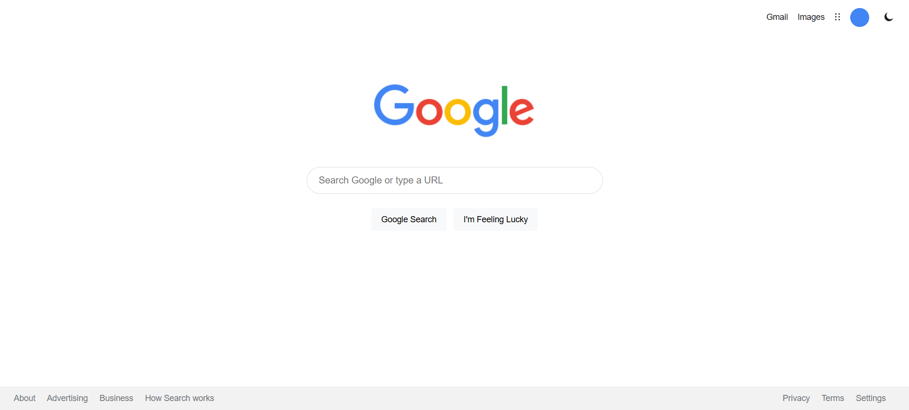

# Google Search Clone

A recreation of Google’s homepage built from scratch using HTML, CSS, and JavaScript.

## 📸 Screenshot

## Features

- Custom autocomplete system
- Dark mode with saved preference (localStorage)
- Real Google search integration
- Component-based structure (no frameworks)

## Purpose

This project is part of my effort to move beyond tutorials and understand how real interfaces are structured and behave.

More improvements coming soon.
